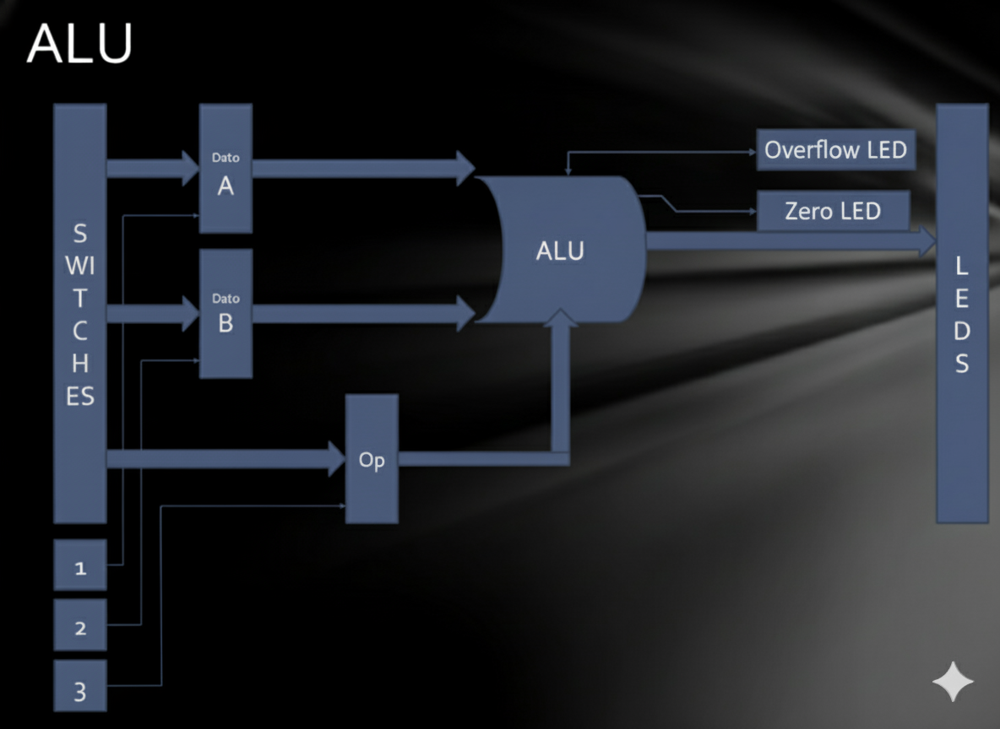

# **TRABAJO PRÁCTICO NÚMERO I : ALU** # 

## **Descripción** ##

Este trabajó consistió en diseñar e implementar una Arithmetic Logic Unit (ALU) en Verilog para ser sintetizada sobre una FPGA Basys3. La ALU que se implementó, permite realizar un total de 8 operaciones cada con su correspondiente código de 6 bits:

Los operandos ingresados son **números signados** (es decir, el primer bit indica el signo del número: 1 si es negativo y 0 en caso contrario) de 8 bits. Se configurarón en total un conjunto de 8 switches y 3 botones para ingresar el valor de los operandos y el código de operación (en el caso de este último, se usan los 6 switches asociados a los bits menos significativos). Por último, el resultado se muestra en un conjunto de 8 LEDS consecutivo más 2 LEDS extra para overflow y cero. El esquema lógico resultante es el siguiente:

Imágen 1: Diagrama lógico del trabajo práctico 

## **Estructura del código** ##

### **alu.v** ###

Este archivo implementa el módulo de la alu.

El tamaño de los operandos y el código de operación son parametrizables ( con valor por defecto  8 y 6 bits respectivamente) mediante `NB_DATA` y `NB_OP`. Las señales de entrada y salida se definen como:

**Entradas**:

`i_data_a` y `i_data_b`: operandos de entrada, tratados como números con signo (signed).

`i_operation_code`: indica qué operación debe ejecutar.

**Salidas**:

`o_result`: resultado de la operación.

`o_overflow`: bit de overflow en suma o resta.

`o_zero`: bit cero.

**Código**:

    module alu #(
        parameter NB_DATA=8,
        parameter NB_OP=6             
    )
    (
        input wire signed  [NB_DATA-1:0] i_data_a,
        input wire signed  [NB_DATA-1:0] i_data_b,
        input wire         [NB_OP-1:0]   i_operation_code,
        output wire signed [NB_DATA-1:0] o_result,
        output wire o_overflow,
        output wire o_zero
    );

Los códigos de cada operación se definen como constantes (`localparam`) 

Luego se definen registros internos para ser usados dentro de un bloque `always` y actualizar tanto el resultado los bits de overflow y zero. El bloque se ejecuta frente a cualquier cambio en la señales de entrada y realiza la operación correspondiente según el código de operacion ingresado.

    reg signed [NB_DATA-1:0] result;
    reg ovflw;
    reg z;

    always @(*) begin

        result  = {NB_DATA{1'b0}};
        ovflw   = 1'b0;

        case (i_operation_code)

            ADD_OP: // ADD
                begin
                    result = i_data_a + i_data_b; 
                    ovflw = (i_data_a[NB_DATA-1]== i_data_b[NB_DATA-1]) & (i_data_a[NB_DATA-1]!=result[NB_DATA-1]);
                end

            SUB_OP: // SUB
                begin
                    result = i_data_a - i_data_b;
                    ovflw = (i_data_a[NB_DATA-1]!= i_data_b[NB_DATA-1]) & (i_data_a[NB_DATA-1]!=result[NB_DATA-1]);
                end

            AND_OP: result = i_data_a & i_data_b; // AND

            OR_OP: result = i_data_a | i_data_b; // OR

            XOR_OP: result = i_data_a ^ i_data_b; //XOR

            SRA_OP: result = i_data_a >>> i_data_b; //SRA

            SRL_OP: result = i_data_a >> i_data_b; //SRL 

            NOR_OP: result = ~(i_data_a | i_data_b); //NOR

            default: result = {NB_DATA{1'b0}};

        endcase

        z = (result == {NB_DATA{1'b0}});

    end

finalmente, se asignan los registros internos a las salidas definidas anteriormente:

    assign o_result = result;
    assign o_overflow = ovflw;
    assign o_zero = z;

### **alu_tb.v** ###

La función de este archivo es generar una serie de tests, que se corren sobre  una simulación en el entorno de Vivado,para verificar el correcto funcionamiento del módulo **alu.v**

En primera instancia se definen los mismos párametros, códigos de operación y señales internas con los que la ALU trabaja:

    parameter NB_DATA = 8;
    parameter NB_OP   = 6;

    // Códigos de operación
    localparam OP_ADD = 6'b100000;
    localparam OP_SUB = 6'b100010;
    localparam OP_AND = 6'b100100;
    localparam OP_OR  = 6'b100101;
    localparam OP_XOR = 6'b100110;
    localparam OP_SRA = 6'b000011;
    localparam OP_SRL = 6'b000010;
    localparam OP_NOR = 6'b100111;

    reg [NB_DATA-1:0] data_a, data_b;
    reg  [NB_OP-1:0]   op_code;
    wire [NB_DATA-1:0] result;
    wire overflow, zero;

Luego, se instancia un módulo de la ALU como UUT (Unit Under Test)

    alu #(
        .NB_DATA(NB_DATA),
        .NB_OP(NB_OP)
    ) uut (
        .i_data_a(data_a),
        .i_data_b(data_b),
        .i_operation_code(op_code),
        .o_result(result),
        .o_overflow(overflow),
        .o_zero(zero)
    );

A continuación, se inicializan las señales  y se espera 10 ns antes de empezar las pruebas. Se generan valores aleatorios para A y B para entonces testear todas las operaciones una por una.  Para cada operación, se calcula el resultado esperado en software y se llama a la tarea `run_test` para verificar si la ALU coincide.

    initial begin
        data_a = 0;
        data_b = 0;
        op_code = 0;
        #10;

    repeat (10) begin
        A = $random;
        B = $random;

    // Suma
    expected = A + B;
    run_test(A, B, OP_ADD, expected, "ADD");

    // Resta
    expected = A - B;
    run_test(A, B, OP_SUB, expected, "SUB");

    // AND
    expected = A & B;
    run_test(A, B, OP_AND, expected, "AND");

    // OR
    expected = A | B;
    run_test(A, B, OP_OR, expected, "OR");

    // XOR
    expected = A ^ B;
    run_test(A, B, OP_XOR, expected, "XOR");

    // SRA
    expected = A >>> B;
    run_test(A, B, OP_SRA, expected, "SRA");

    // SLA
    expected = A <<< B;
    run_test(A, B, OP_SRL, expected, "SRL");

    // NOR
    expected = ~(A | B);
    run_test(A, B, OP_NOR, expected, "NOR");
    
    end

Por último, el testbench evalúa casos especifícos donde ocurre overflow y/o operaciones con resultado igual a 0 

    // Overflow positivo: 255 + 1
    run_test(255, 1, OP_ADD, 0, "ADD Overflow Positivo");

    // Overflow negativo: 100 - 128
    run_test(100, -128, OP_SUB, 228, "SUB Overflow Negativo");

    // Resultado cero: 5 - 5
    run_test(5, 5, OP_SUB, 0, "SUB Zero");

    // Resultado cero: 0 & 0
    run_test(0, 0, OP_AND, 0, "AND Zero");

En la siguiente imagen se corre la simulación en Vivado y se verifica el correcto funcionamiento del módulo ALU

### **top.v** ###

Es el módulo superior del sistema. Se encarga de instanciar el módulo de la ALU asi como también de manejar los valores de las entradas y salidas (de acuerdo a un clock) definidas según el esquema lógico de la Imágen 1

**Parámetros**:

`N_SWITCHES`: cantidad de switches de entrada (por defecto 8).

`N_BUTTONS`: cantidad de botones (3 en este diseño).

`NB_OPERATIONS`: cantidad de bits del código de operación (6).

`N_LEDS`: cantidad de LEDs de salida (8).

**Entradas**:

`i_clk`: reloj del sistema.

`i_sw`: conjunto de switches que ingresan datos u operaciones.

`i_button`: 3 botones usados para decidir qué estamos cargando (A, B u operación).

`reset_button`: reinicia todo a cero.

**Salidas**:

`o_led`: resultado de la operación de la ALU (mostrado en LEDs).

`o_overflow`: Led de overflow.

`o_zero`: Led de reultado cero.

    module top #(
        parameter N_SWITCHES=8,
        parameter N_BUTTONS=3,
        parameter NB_OPERATIONS=6,
        parameter N_LEDS=8
    )
    (
        input wire                   i_clk,
        input wire  [N_SWITCHES-1:0] i_sw,
        input wire  [N_BUTTONS-1:0]  i_button,
        input wire                   reset_button,
        output wire [N_LEDS-1:0]     o_led,
        output wire                  o_overflow,
        output wire                  o_zero
    );

Luego se definen las señales internas:

    reg signed [N_SWITCHES-1:0] i_data_a, i_data_b;
    reg [NB_OPERATIONS-1:0] i_operation_code;

`i_data_a` y `i_data_b`: operandos internos que se conectan a la ALU.

`i_operation_code`: operación que debe ejecutar la ALU.

Una vez hecho esto, se procede a instanciar el modulo de la ALU. Se asocian las entradas del módulo Top a las entradas de la ALU y el resultado de la operación, así como los bits de overflow y zero, a los Leds de salida correspondientes.

    alu #(
        .NB_DATA(N_SWITCHES),
        .NB_OP(NB_OPERATIONS)
    ) alu_unit (
        .i_data_a(i_data_a),
        .i_data_b(i_data_b),
        .i_operation_code(i_operation_code),
        .o_result(o_led),
        .o_overflow(o_overflow),
        .o_zero(o_zero)
    );

Finalmente, se define un bloque secuencial `always` que actualiza los valores de los operandos y el código de operación en cada flanco ascendente del reloj según el botón que esté pulsado.

    always @(posedge i_clk) begin

        if (reset_button) begin
            i_data_a <= {(N_SWITCHES) {1'b0}};
            i_data_b <= {(N_SWITCHES) {1'b0}};
            i_operation_code <= {(NB_OPERATIONS) {1'b0}};
        end

        else begin 
            if (i_button[0]) begin //Pulsador 1 = Data A
                i_data_a <= i_sw;
            end
            if (i_button[1]) begin //Pulsador 2 = Data B
                i_data_b <= i_sw;
            end
            if (i_button[2]) begin //Pulsador 3 = Operation
                i_operation_code <= i_sw[NB_OPERATIONS-1:0]; 
            end
        end

    end

### **tp1_constraints.xdc** ###

Define los botones,switches,leds y el valor del clock que se utilizan en la placa